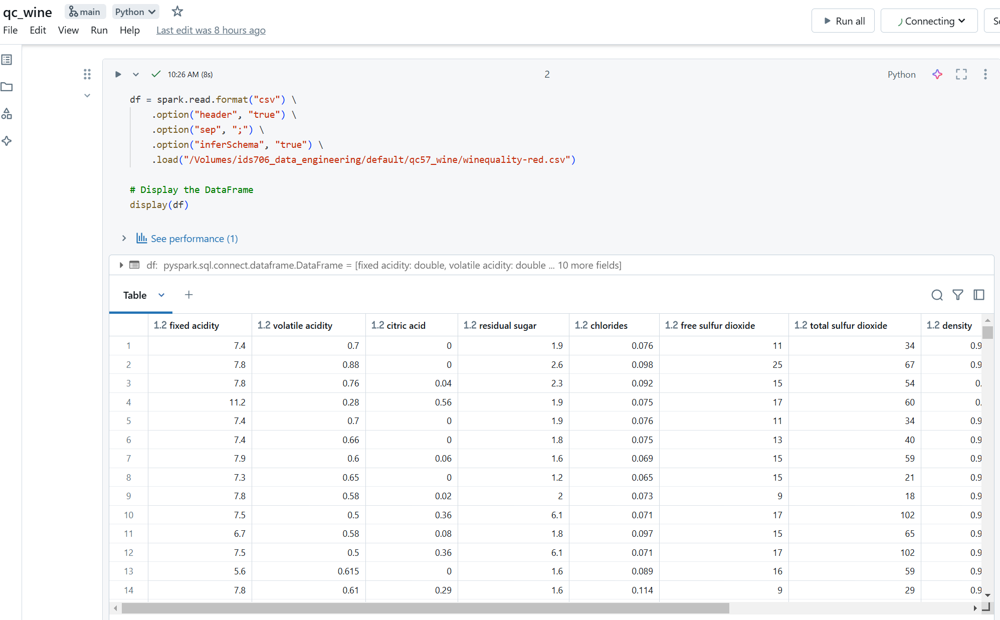
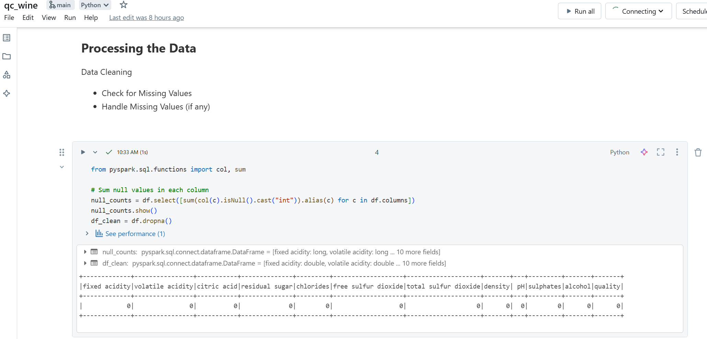
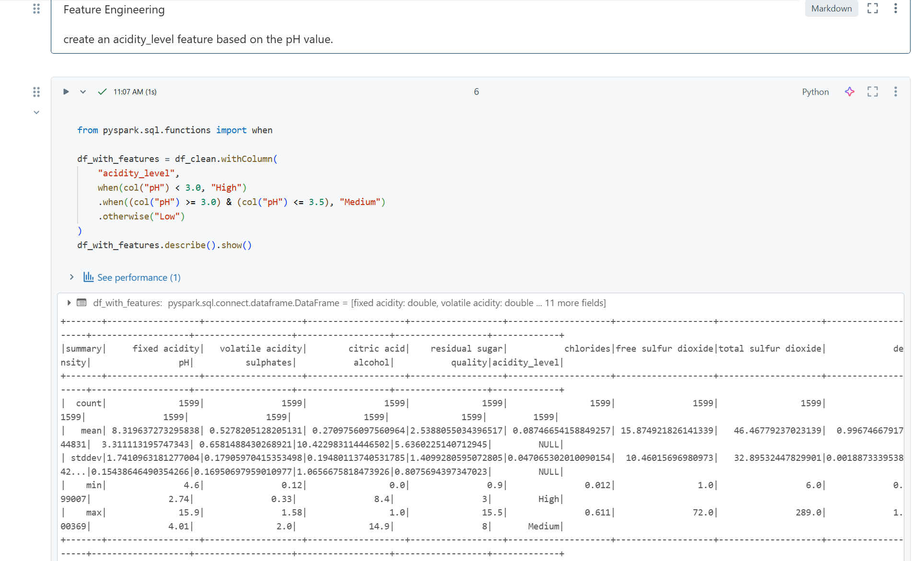
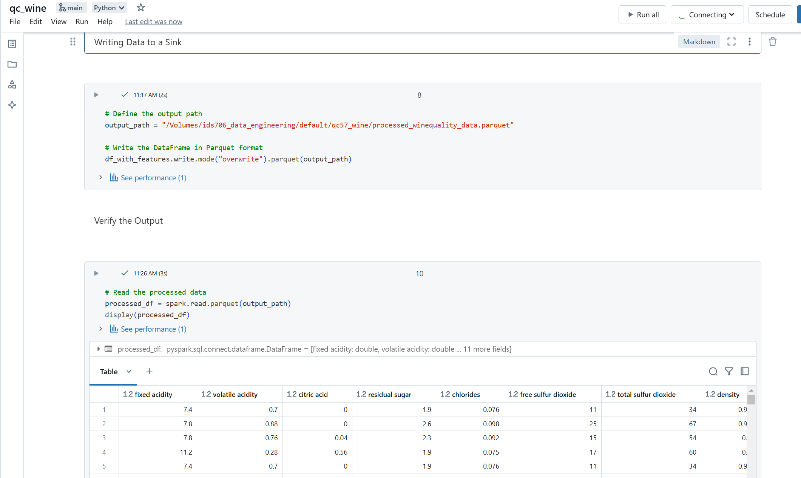

以下是可以直接复制的 `README.md` 文件内容：

---

# **Data Pipeline with Databricks**

## **Project Description**
This project demonstrates the implementation of a data pipeline using Databricks. The pipeline processes a dataset of red wine quality metrics, performs data cleaning, feature engineering, and writes the processed data to a specified data sink. The pipeline is integrated with a CI/CD workflow using GitHub Actions to ensure seamless deployment and execution.

---

## **Features**
1. **Data Source**:
   - CSV file: `winequality-red.csv`, containing quality metrics for red wine.
2. **Data Processing**:
   - **Data Cleaning**: Handle missing values by dropping null rows.
   - **Feature Engineering**: Create a new feature `acidity_level` based on the `pH` value.
3. **Data Sink**:
   - The processed data is written to a Parquet file in a specified location.
4. **CI/CD Integration**:
   - GitHub Actions workflow for continuous integration and deployment.
   - Automated script upload and execution on Databricks.

---

## **Pipeline Functionality**
1. **Input Data**: 
   - The CSV file is loaded into a PySpark DataFrame.
2. **Data Cleaning**:
   - Missing values are identified and handled by dropping rows with nulls.
3. **Feature Engineering**:
   - Add a column `acidity_level`:
     - `High` if `pH < 3.0`
     - `Medium` if `3.0 ≤ pH ≤ 3.5`
     - `Low` otherwise
4. **Data Output**:
   - Write the processed data to a Parquet file.

---

## **Pipeline Configuration**
- **Data Source**:  
  CSV file located at `/Volumes/ids706_data_engineering/default/qc57_wine/winequality-red.csv`.
- **Data Sink**:  
  Processed Parquet file written to `/Volumes/ids706_data_engineering/default/qc57_wine/processed_winequality_data.parquet`.
- **Environment**:  
  The pipeline is developed and executed on Databricks with PySpark.

---

## **CI/CD Integration**
- GitHub Actions is used to automate:
  1. Script upload to Databricks Workspace.
  2. Job execution in Databricks.
- CI/CD Workflow Stages:
  1. **Build**: Upload script to Databricks.
  2. **Lint**: Ensure code conforms to PEP 8 standards.
  3. **Test**: Check for script syntax errors.


## **Setup and Execution**

### **1. Databricks Configuration**
- Upload the `qc_wine.py` script to your Databricks Workspace at:
  `/Users/<your-username>/Data-Pipeline-with-Databricks/qc_wine.py`.

### **2. Run the Pipeline**
- Manually execute the script in Databricks or use the configured CI/CD workflow.

### **3. CI/CD Workflow**
[](https://github.com/iikikk/Data-Pipeline-with-Databricks/actions/workflows/ci.yml)
- Trigger the CI/CD pipeline by pushing changes to the `main` branch:
  ```bash
  git add .
  git commit -m "Update script and configuration"
  git push origin main
  ```
- The workflow will:
  1. Upload the script to Databricks.
  2. Run the pipeline on Databricks using the Databricks Jobs API.

### Screenshot





